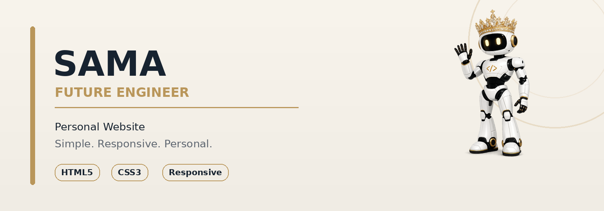
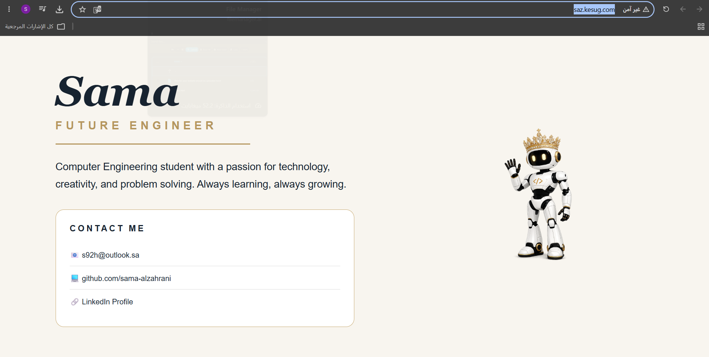
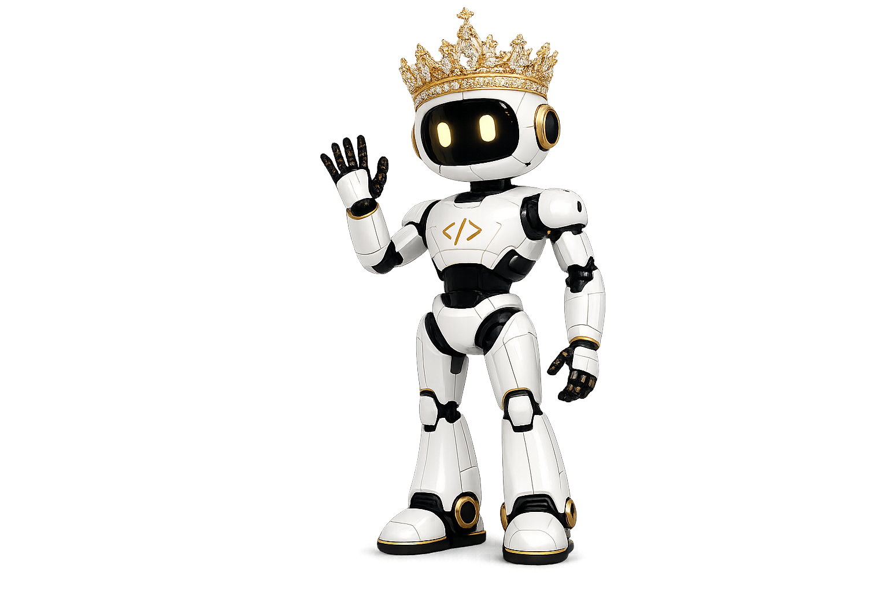

<div align="center">



<br>

# 🤖 Sama | Future Engineer

### A simple personal website that reflects my identity as a Computer Engineering student.

<br>


</div>

---

## 🌐 About the Project

This project is a simple and responsive personal website created to represent my personality, academic background, and passion for technology.

The website introduces me as a Computer Engineering student and provides direct access to my professional accounts.

A custom robot character was used to reflect my interest in engineering, creativity, technology, and continuous learning.

---

## ✨ Website Preview

<div align="center">



</div>

---

## 🚀 Features

- Clean and modern personal interface
- Custom robot character
- Responsive design for desktop and mobile devices
- Clickable email address
- Direct GitHub profile link
- Direct LinkedIn profile link
- Simple and organized layout
- No installation required
- Fast and lightweight website

---

## 🛠️ Technologies Used

<div align="center">


</div>

<br>

| Technology | Purpose |
|---|---|
| HTML5 | Creating the website structure and content |
| CSS3 | Styling the website and organizing the layout |
| Media Queries | Making the website responsive on different screens |
| Visual Studio Code / Notepad++ | Writing and editing the code |
| GitHub | Uploading and sharing the project |

---

## 📱 Responsive Design

The website automatically adapts to different screen sizes.

### Desktop

The personal information and contact section appear on the left, while the robot appears on the right.

### Mobile

The content is displayed vertically to make the website easier to read and use on smaller screens.

---

## 📂 Project Structure

```text
Personal-Website
│
├── index.html
├── robot2.png
├── README.md
│
└── images
    ├── cover.png
    ├── website-preview.png
    └── robot.png
```

## 📬 Contact Me

<div align="center">

[](mailto:s92h@outlook.sa)

[](https://github.com/sama-alzahrani)

[](https://www.linkedin.com/in/sama-alzahrani-a87733372/)

</div>

---

## 🤖 Website Character

<div align="center">



<br>

The robot character represents creativity, engineering, ambition, and the journey toward becoming a future engineer.

</div>


---
## 🌐 Live Website

[](http://saz.kesug.com/)
---

## 👩🏻‍💻 Author

<div align="center">

### Sama Al-Zahrani

Computer Engineering Student

Future Engineer

<br>

> Learning today. Building tomorrow 🤍.

</div>

---
